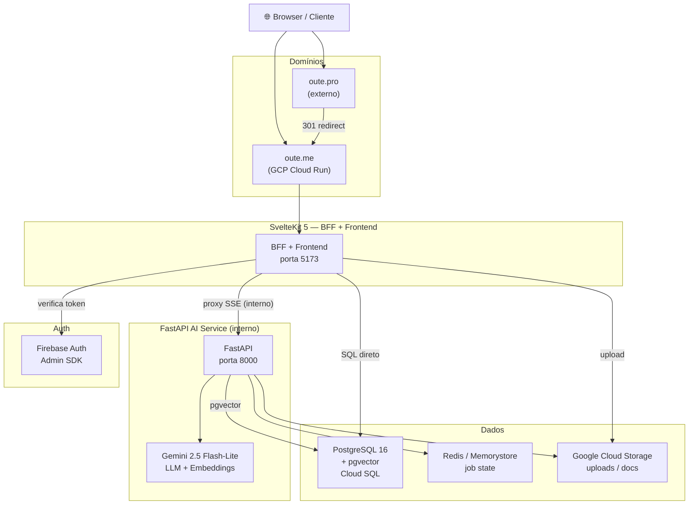

```mermaid
flowchart TD
    Browser["🌐 Browser / Cliente"]

    subgraph Domínios
        OuteMe["oute.me\n(GCP Cloud Run)"]
        OutePro["oute.pro\n(externo)"]
    end

    subgraph App ["SvelteKit 5 — BFF + Frontend"]
        SK["BFF + Frontend\nporta 5173"]
    end

    subgraph AI ["FastAPI AI Service (interno)"]
        FA["FastAPI\nporta 8000"]
        Gemini["Gemini 2.5 Flash-Lite\nLLM + Embeddings"]
    end

    subgraph Auth
        FB["Firebase Auth\nAdmin SDK"]
    end

    subgraph Data ["Dados"]
        PG["PostgreSQL 16\n+ pgvector\nCloud SQL"]
        Redis["Redis / Memorystore\njob state"]
        GCS["Google Cloud Storage\nuploads / docs"]
    end

    Browser --> OuteMe
    Browser --> OutePro
    OutePro -->|"301 redirect"| OuteMe
    OuteMe --> SK
    SK -->|"proxy SSE (interno)"| FA
    SK -->|"verifica token"| FB
    SK -->|"SQL direto"| PG
    SK -->|"upload"| GCS
    FA --> Gemini
    FA -->|"pgvector"| PG
    FA --> Redis
    FA --> GCS
```
